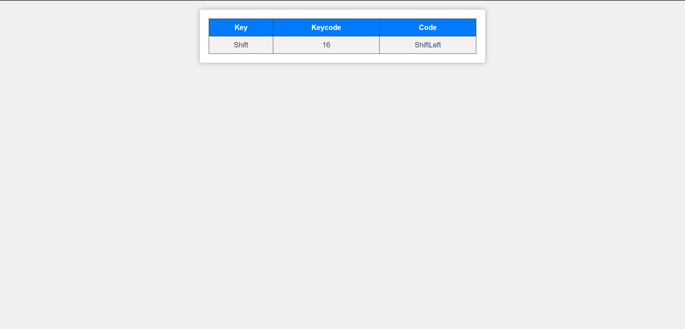
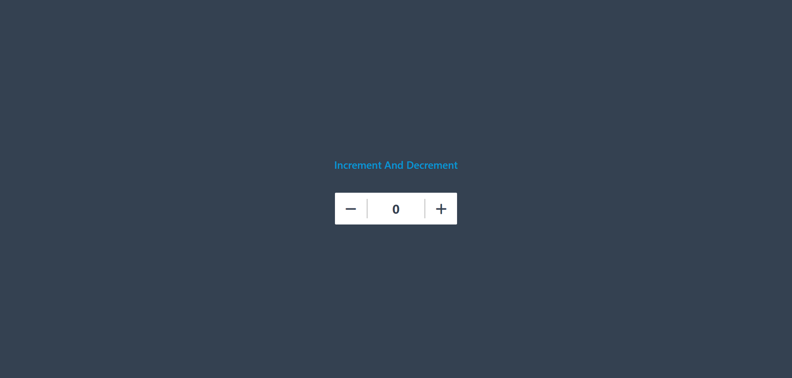

# JavaScript Mini Projects

Welcome to the JavaScript Mini Projects repository! This collection showcases a series of fun and interactive web projects developed using JavaScript. Each project offers a unique experience and provides a great way to learn and experiment with JavaScript.

## Project List

1. **BMI Calculator**
   - Quickly determine your Body Mass Index (BMI) with this user-friendly tool. Enter your height and weight to assess your health status.

2. **Share Modal**
   - The elegant solution for effortlessly sharing profiles with a touch of style.

3. **Keyboard**
   - Explore the magic of keyboard events as this project dynamically displays the key, key code, and event code when a key is pressed.

4. **Background Color Switcher**
   - A fun project that lets you change the background color with the click of a button, adding a touch of visual creativity to your web page.

5. **Digital Clock**
   - A simple yet functional project that displays the current time on your web page in a digital format, helping you keep track of time effortlessly.

6. **Number Guessing Game**
   - Test your guessing skills with this interactive game where you have 10 attempts to guess a random number between 1 and 100.

7. **Unlimited Colors**
   - Experience a dynamic background color changer that continuously cycles through a spectrum of hues, adding vibrancy and creativity to your webpage with a simple click.

8. **Counter**
   - A simple yet effective web application for easy counting with style.

## Getting Started

1. Clone this repository to your local machine.
2. Open the project's folder in your code editor.
3. Follow the specific project's README or setup instructions (if available) to run each project locally.

## Usage

For each project, you can access a live demo by clicking on the project title or screenshot on the [webpage](https://skimran-coder.github.io/JavaScript_Mini_Projects/).

Detailed usage instructions for each project can be found in their respective README files.

## Screenshots

.png)

## Technologies Used

- HTML
- CSS
- JavaScript

## Contributing

We welcome contributions! If you have ideas for improvements or new mini projects.

Happy coding!
